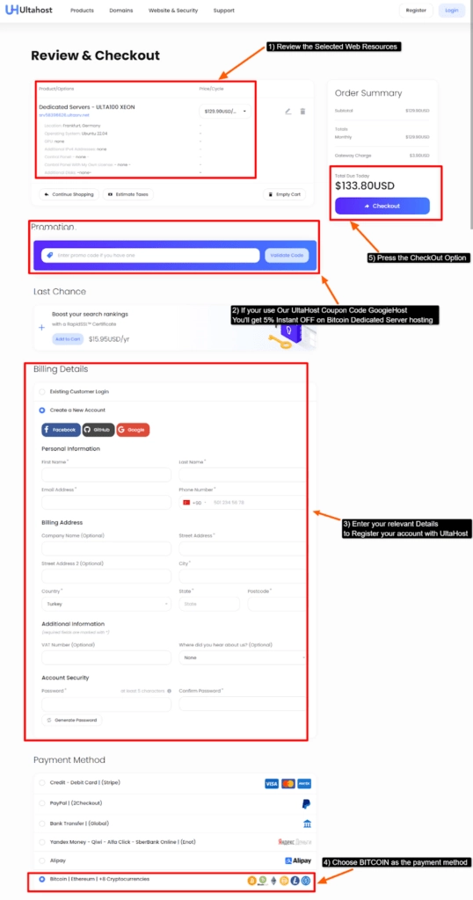

# 2025年10月，7个接受比特币支付的优质独立服务器推荐

---

想用比特币租服务器？其实没你想的那么复杂。

现在越来越多服务商开始接受加密货币支付，对于注重隐私或者手头正好有点币的用户来说，这简直是天然的选择。独立服务器本身性能强劲，再加上比特币支付的便捷性，整个体验确实顺畅不少。

这篇文章会带你看看7家靠谱的独立服务器提供商——它们都支持比特币结账，配置明确，价格透明。我们还会展示具体的下单流程，包括比特币支付界面的截图，让你心里有个底。

---

## 什么是比特币独立服务器？

说白了，就是那些在结账时允许你用比特币或其他加密货币付款的独立服务器服务。

自从比特币、以太坊、莱特币这些加密货币流行起来，支付流程变得简单多了。你只需要在结账时填写钱包地址，扫个码，就能完成交易——不需要信用卡，不需要银行账户，甚至不需要透露真实身份。

对于需要高性能计算资源、重视数据隐私、或者本身就持有加密货币的用户来说，这类服务器是个实在的选择。服务器的核心性能不会因为支付方式而打折扣，你该得到的CPU、内存、带宽一样不少。如果你正在寻找能够提供**全球数据中心覆盖、灵活配置、稳定运行**的服务器方案，👉 [Vultr的独立服务器值得一试，支持按需部署，按小时计费](https://www.vultr.com/?ref=9738262-9J)。它们在全球30多个位置都有节点，无论你的用户在哪里，都能获得不错的访问速度。

## 7家接受比特币的优质独立服务器提供商（2025）

下面是2025年支持比特币支付的7家独立服务器服务商，每家都有自己的特点和适用场景。

**1. UltaHost** - 综合性价比最优  
**2. InterServer** - 企业级可靠选择  
**3. HostWinds** - 预算友好型方案  
**4. Shinjiru** - 新手友好配置  
**5. HawkHost** - 经济实惠方案  
**6. Vultr** - 云服务器灵活部署  
**7. Coin.host** - 专注加密货币支付

### 1. UltaHost - 综合性价比最优

UltaHost提供快速、安全、可靠的独立服务器，配备DDoS防护和恶意软件扫描，数据安全有保障。

服务包含免费备份功能，需要时可以快速恢复数据。新用户还能享受免费迁移服务，如果你之前在其他服务商那里，可以零成本转过来。

**核心特点：**

🔶 **免费SSL证书**：为所有网站提供Let's Encrypt SSL证书，确保访问加密  
🔶 **多操作系统支持**：可选Debian、Ubuntu、Windows、AlmaLinux、CentOS等  
🔶 **完整服务器访问权限**：Root权限完全开放，按需配置  
🔶 **99.99%在线率保证**：确保服务持续可用

**价格方案**

🔔 **限时优惠**：年付计划最高可享40%折扣，使用优惠码"GoogieHost"还能在年付和季付基础上额外获得7%优惠。

### 2. InterServer - 企业级可靠选择

InterServer以10Gbps独立服务器闻名，提供高度可扩展的方案、多种操作系统选择和全天候技术支持。

服务器基于可靠硬件构建，保证24/7运行时间。支持比特币支付，也提供完全托管型独立服务器，适合技术经验较少的用户。

**核心特点：**

🔶 **接受比特币**：支持比特币和其他加密货币支付  
🔶 **24/7服务器监控**：全天候监控，快速配置和恶意软件扫描  
🔶 **私有局域网**：可设置VLAN安全环境  
🔶 **最低1Gbps带宽**：确保快速加载速度

**价格方案**

| 方案 | 配置 | 价格 |
|------|------|------|
| 基础型 | AMD RYZEN 5600X CPU + 64GB RAM + 2TB SATA | $25/月 |
| 高级型 | AMD RYZEN 3900X CPU + 64GB RAM + 2TB SATA | $25/月 |
| 旗舰型 | AMD RYZEN 5900X CPU + 64GB RAM + 2TB SATA | $25/月 |

🔔 **限时优惠**：使用优惠码"GRABPENNY"可享1个月仅$3的体验价。

### 3. HostWinds - 预算友好型方案

HostWinds提供完全托管的独立服务器，配备可靠硬件和出色性能。完全托管服务让没有技术背景的用户也能专注于网站内容本身。

支持比特币支付，提供多种操作系统选择。遇到配置问题时，专家支持团队随时待命。

**核心特点：**

🔶 **RAID技术**：采用可靠磁盘阵列，确保数据安全和快速访问  
🔶 **夜间备份**：自动备份机制，快速恢复数据  
🔶 **完全托管服务**：用户可专注于网站内容  
🔶 **多服务器位置**：可根据目标受众选择数据中心

**价格方案**

| 方案 | 配置 | 价格 |
|------|------|------|
| 入门型 | 8GB RAM + 10TB带宽 + 1处理器4核CPU | $25/月 |
| 标准型 | 32GB RAM + 30TB带宽 + 1处理器4核CPU | $25/月 |
| 高级型 | 28GB RAM + 10TB带宽 + 2处理器4核CPU | $127/月 |

🔔 **限时优惠**：自管服务器价格最高可节省50%。

### 4. Shinjiru - 新手友好配置

Shinjiru以离岸独立服务器著称，提供无限速度、强大DDoS防护、最新内部服务器和99.99%在线率保证。

这是优质的比特币独立服务器服务之一。Shinjiru还提供24/7实时支持，帮助配置服务器遇到困难的用户。完全托管的独立服务器让零技术背景的用户也能轻松上手。

**核心特点：**

🔶 **可靠独立服务器**：基于强大硬件，配备SSD存储和顶级安全机制  
🔶 **1个IPv4地址**：确保独立托管环境，不受其他用户干扰  
🔶 **最低1Gbps带宽**：确保高可访问性和快速加载  
🔶 **i5 Core传统CPU**：提供强大的处理能力

**价格方案**

| 方案 | 配置 | 价格 |
|------|------|------|
| 价值型 | 2TB HDD存储 + 16GB RAM | $49.90/月 |
| 高级型 | 256GB SSD存储 + 16GB RAM | $59.90/月 |
| 旗舰型 | 256GB SSD存储 + 16GB RAM | $79.90/月 |

🔔 **限时优惠**：首30天托管享受3%折扣。

### 5. HawkHost - 经济实惠方案

HawkHost以半独立服务器托管服务闻名，提供先进的SSD存储技术以实现快速网站加载、无限域名选项、所有域名的免费SSL证书，以及半独立托管计划中运作良好的免费网站构建器。

HawkHost还提供保护性恶意软件扫描和网络防护，保护您的网站数据免受恶意在线威胁。

**核心特点：**

🔶 **多种支持渠道**：从实时聊天、工单系统到邮件和电话支持  
🔶 **免费迁移支持**：已在其他托管公司注册的用户可零费用迁移  
🔶 **99.90%保证在线率**：确保访问者快速访问网站  
🔶 **用户友好的cPanel控制面板**：易于使用的管理界面

**价格方案**

| 方案 | 配置 | 价格 |
|------|------|------|
| Nestling计划 | 20GB磁盘空间 + 无限带宽 + 免费迁移 | $14.99/月 |
| Talon计划 | 无限磁盘空间 + 无限带宽 + 免费迁移 | $37.49/月 |

🔔 **限时优惠**：年付计划低至$13.49/月。

### 6. Vultr - 云服务器灵活部署

Vultr以其容器化和Kubernetes服务闻名于开发者社区，为需要更多独立资源的高性能网站或应用提供完全托管的裸机服务器。

Vultr的预算友好型云服务器提供出色可靠的NVIDIA GPU服务器，实现快速和优秀的网站性能。如果你需要**按需扩展、全球部署、灵活计费**的云服务器方案，👉 [Vultr的云计算平台提供了从虚拟机到裸金属服务器的完整产品线](https://www.vultr.com/?ref=9738262-9J)，按小时计费模式让你只为实际使用付费，不用担心高额账单。

**核心特点：**

🔶 **持续专家支持**：全天候支持服务快速解决服务器相关问题  
🔶 **完全托管服务器**：用户可专注于网站增长  
🔶 **完整Root访问权限**：完全控制权，按需配置  
🔶 **按小时计费**：按使用付费，无需担心高额账单

**价格方案**

🔔 **限时优惠**：裸金属独立服务器起价仅$120.00/月。

### 7. Coin.host - 专注加密货币支付

如名称所示，CoinHost提供接受比特币支付的独立服务器托管，面向希望获得专用资源改善网站的用户。

还可获得优质连接，实现出色的网站速度和强大的DDoS防护。CoinHost提供全天候支持服务，帮助需要解决服务器相关问题的用户。

**核心特点：**

🔶 **99.90%保证在线率**：确保网站24/7对访问者可用  
🔶 **免费KVM/IMPI**：为独立服务器提供顶级安全，确保完全服务器访问  
🔶 **完整磁盘加密**：确保强大的数据安全，防止任何网络泄露  
🔶 **最大冗余**：本地独立服务器为网站提供最大冗余

**价格方案**

🔔 **限时优惠**：独立服务器计划享22%折扣，期限1年。

## 用比特币购买独立服务器有什么好处？

使用比特币支付独立服务器有几个实际优势：

- **保护银行账户余额**：独立服务器费用不低，用比特币支付可以避免银行账户大额扣款
- **结账流程简单**：零登录体验，输入比特币钱包地址后立即开始支付
- **支付方式安全**：加密货币采用的高级安全策略确保安全的计费环境
- **支付速度快**：使用比特币支付可确保快速启动，独立服务器激活不会延迟

## 如何用比特币购买独立服务器？

以UltaHost为例，展示完整的比特币支付流程：

1. 访问UltaHost官网 → 点击托管标签 → 选择独立服务器选项

2. 点击独立服务器选项 → 按下订购按钮

3. 配置页面弹出 → 选择适当的计费周期 → 选择目标受众的服务器位置 → 选择服务器相关资源（OS/GPU/IPv4/控制面板）→ 按继续

4. 审核页面弹出 → 检查配置的资源 → 添加UltaHost折扣优惠码（如有）→ 输入登录详细信息 → 在支付方式中选择BITCOIN → 点击结账

5. 发票弹出 → 按"使用Cryptomus支付"继续交易

6. 选择BITCOIN支付网络 → 点击"前往支付"继续

7. 扫描屏幕上的二维码 → 在处理支付的设备中输入支付详细信息 → 等待确认

支付成功完成后，等待确认邮件发送到注册邮箱。收到确认邮件后，您的独立服务器将按计划激活。

**注意**：如果在订购过程中遇到任何技术问题，可以通过实时聊天和工单系统联系技术支持人员。

---

## 总结

现在连杂货店都开始接受比特币了，用比特币租服务器自然也不是什么新鲜事。

这篇文章介绍了7家2025年支持比特币和其他加密货币支付的优质独立服务器提供商。每家都有自己的特色——UltaHost综合性价比高，InterServer企业级可靠，Vultr云服务灵活。

如果还在犹豫选哪个，可以从**保证在线率、完整Root访问权限、可靠硬件**这几个角度考虑。对于需要全球覆盖和灵活配置的用户来说，**UltaHost**、**InterServer**和**Vultr**都是不错的选择。
